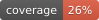

<p align="center">

[](https://github.com/pre-commit/pre-commit)


</p>

# 📊 Data Collector Service

Репозиторий предназначен для **коллекционирования данных** с внешних источников (например, API Тинькофф) и последующей записи в базу данных (TimescaleDB).  
Данные собираются по вызову определённой **ручки FastAPI**, которая инициирует пайплайн: определение последней даты в базе, запрос новых данных, фильтрация и сохранение.

---

## 🚀 Цель

Автоматизация процесса сбора и дозаписи новых данных в TimescaleDB на основе расписания или ручного запроса через FastAPI эндпоинт.

---

## 🧑‍💻 Правила работы с репозиторием

- Вся разработка ведётся в ветке `dev`
- Для каждой задачи создаётся отдельная ветка от `dev` с названием по номеру задачи, например: `123-add-stock-endpoint`
- После завершения задачи создаётся **Pull Request в `dev`**
- Все PR проходят обязательный **code review**

---

## 💬 Стандарты коммитов

Используем [Conventional Commits](https://www.conventionalcommits.org/en/v1.0.0/):

- `feat:` — добавление нового функционала
- `fix:` — исправление ошибок
- `refactor:` — рефакторинг без изменения внешнего поведения
- `docs:` — изменение/добавление документации
- `chore:` — технические изменения (обновление зависимостей, настройки и т.д.)
- `test:` — добавление/обновление тестов
- `perf:` — улучшение производительности
- `ci:` — изменения в CI/CD

Пример:
```bash
git commit -m "feat: добавлен эндпоинт для загрузки исторических данных по акциям"
```

---

# Запуск на своей машине

#### Установка зависимостей
```bash
pip install pdm
pdm install
```


Активация окружения
```bash
source .venv/bin/activate
```


Запуск на своей машине
```bash
python -m src.server
```

После запуска ui микросервис адоступен по адресу
```bash
http://0.0.0.0:7070/template_fast_api/v1/#/
```


# Запуск контейнера публично

### Строим контейнер
```bash
    docker build -t fast_api_template .
```
Узнаем его IMAGE ID 
```bash
docker images
```

```bash
docker run -d -p 7071:7071 bb1942a77c32
```

```bash
docker run -d -p 80:7071 bb1942a77c32
```

```bash
docker run -d -p 7071:80 <IMAGE ID>
```


# Запуск контейнера локально

### Строим контейнер
```bash
docker build -t data_collection .
```
Узнаем его ID
```bash
docker images
```

```bash
docker run -p 7071:7071 <IMAGE ID>
```

# Я пишу код на Windows 
Молодец! Хотя мне тебя жаль.

### Когда все сломалось

Лечим отказ запуска сервера (address error):
1. В server.py меняем все локалхосты с 0.0.0.0 на 127.0.0.1

2. Проверяем переменные среды:
В "Path" должны находиться пути до версии питона и до сгенерированного виртуального окружения:

Например,
```
C:\Users\1\AppData\Local\Programs\Python\Python312\Scripts\
D:\work_dirs\data_collection\.venv\Scripts
```
3. Если п.1-2 не помогли, то отключить брандмауэр Windows

# Акции Тинькоффа
Запуск из директории
```
D:\work_dirs\data_collection\
```
Необходимые переменные окружения в .env:
1. Токен тинькоффа, который получается путем тыкания банковского менеджера:
TINKOFF_TOKEN=t.my_token

В консоли:
```
pdm install
.\.venv\Scripts\activate
cd D:\work_dirs\data_collection\
python -m src.database_scripts.__main__
```

Запуск Docker-контейнера для тинькофф-акций:
```
 docker build -t data-collector . --load --progress=plain
 docker run data-collector
```
Для отладки:
```
 docker images
```
 
Для остановки контейнера:
```
docker stop data-collector
```